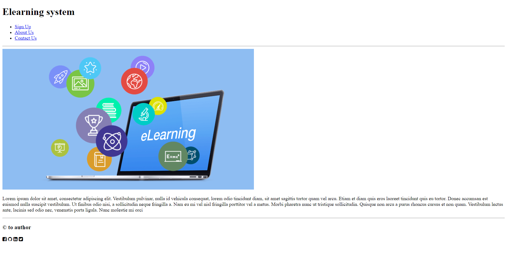

# HTML Basics

## We want to create an e-learning website. For this lab we will create the main page only which contains:

- Header  with the main title of the page and a nav bar with 3 links:

    1. the first link takes you to another page you will create **later** called sign-up.html.
    2. the other two links are about us and contact us links, you can add any links you want here .
- Main that contains an image and  a paragraph with a description about the website .
- Footer: with the copy rights information and the social media icons
- The main page should look like this:

***Note: for the social media icons, you have to search for font awesome.***

- You have to add a title in the head of the webpage along with an appropriate description of the page in the meta description tag.
