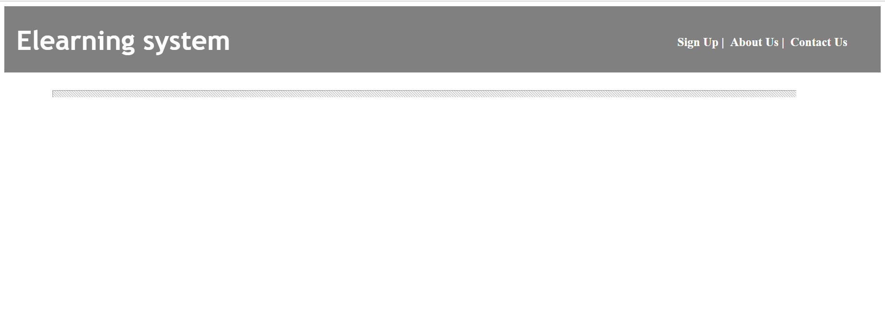
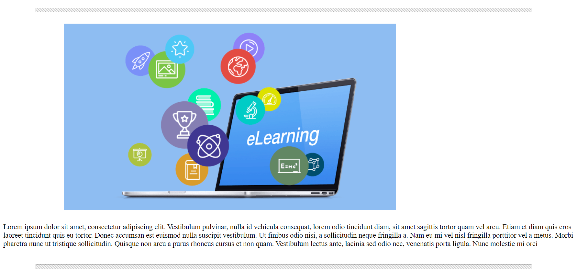
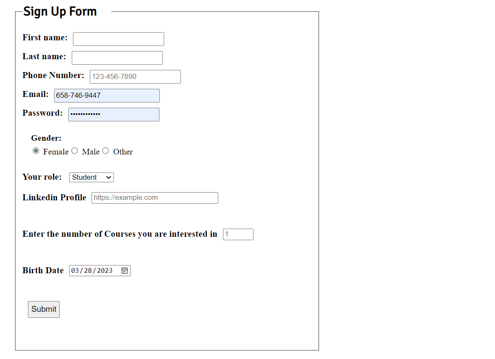

# CSS Basics

## Objective: To understand CSS basics and be able to style webpages using pure CSS

## We want to style the Elearning System website:

## Task
1. The header should have the same style for all pages and  the footer is exactly the same for all pages.
- the footer:

   - *The contact icons must be added*

    *Note: The cursor should change to pointer when the user clicks on the font-awesome icons*

2. - The header of the main page should look like this:

   - The main of the main page should look like this:

    

3. The header and the main of the sign up page should look like this:

- *Note: the form's legend's (Sign Up Form) font-family should be imported as a google font. The font is up to you to choose*
- for the submit button in the form, change the cursor to be a pointer and change the button size when the user clicks on the button.
4. - The header of the courses page has to be the same as the header of the sign up page.
   - the main of the page should look like this:

   
   
      *Note: only the first line of the paragraph should be glowy*

- *The header should be sticky for all of the pages*
- *You can add any other styles you want*
5. For the header links, you should do the following:
   - Make the color changes, the font size bigger and underline the link when you hover over it.
   - when the links are triggered by the user, change the background color for the element.

