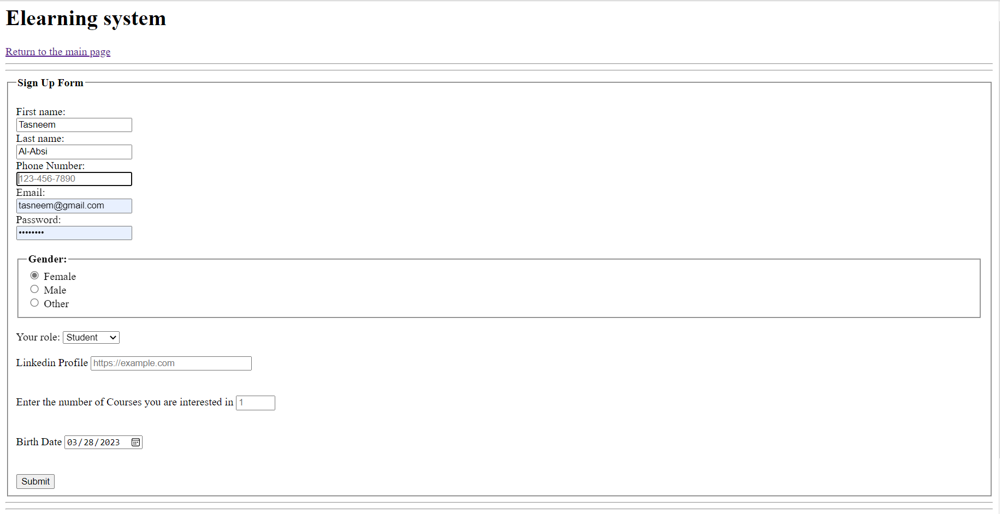
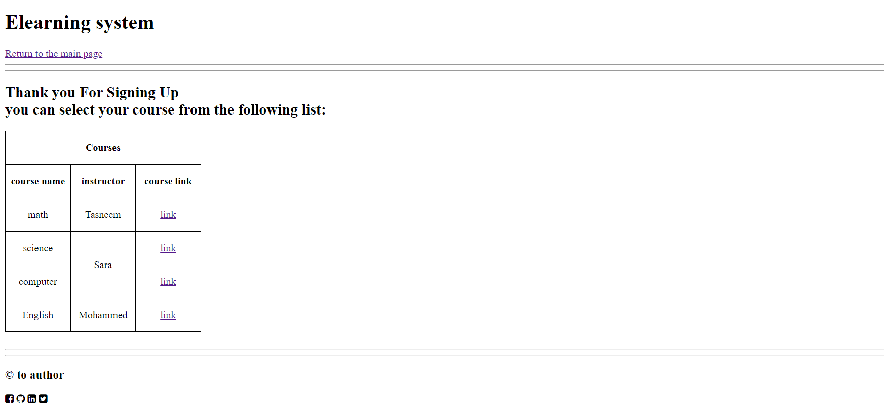

# HTML Basics

## Objective: Understand HTML basics and build a multi-page website. 

## We want to continue with the e-learning website:
- in the main page (That you have already created in the first assignment), we should have a link to the sign up page. Now we want to create the page that should have a form that gathers data about the person that wants to create an account, the fields that should be included in the form are:
- first name
- last name
- Phone number, should match the phone number pattern (and the pattern should be written in the input's placeholder so the user will know what to write). if the user entered an invalid number, they should receive a message that tells them to enter a valid number.
**Note: for this requirement,search for the input pattern and regex phone number pattern. you can also check the title attribute for the message**
- email, should match the email pattern.
- password
- select their gender 
- select their role from a drop down menu, the menu could have the options (student, teacher, employee and manager)
- fill their linkedIn profile URL, the URL also should match the URL pattern and the user should receive a custom message if they entered an invalid URL
- the number of courses they are interested in, the minimum should be 1 course and the maximum number should be the number of courses you will fill in the courses page
- their birth date, this should be a date
- all the fields are required, which means that the user cannot submit the form unless they fill all of the input fields.
- submit button, and when the form is submitted, the user will be taken to another page. (the courses page)
- the header of this page should contain the title and a link to the main page, and the footer should be exactly like the footer of the main page, the sign up page should look like this:

- in the courses page, the header and the footer should match the sign up page, but the main should contain a third level heading that informs the user that their signing up is confirmed along with a table of the courses as the following image (the name of the courses and instructors as well as the links are up to you, you can add any names and links you want)
- the courses page should look like this:

.

### Notes:
1. In the main page, the contact us nav link should have a link to an email address.
2. add a title a meta description tags for each page.
3. if you haven't already added the image to the main page, add it please.
