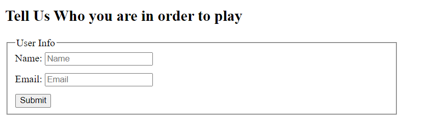
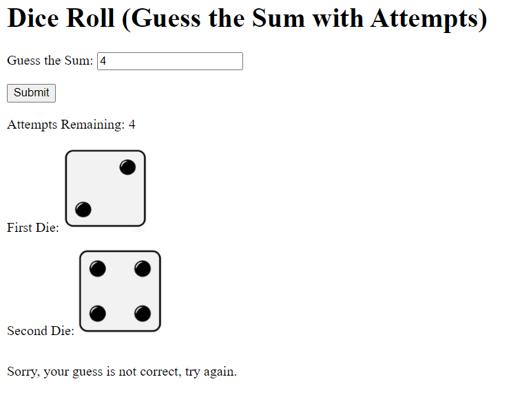
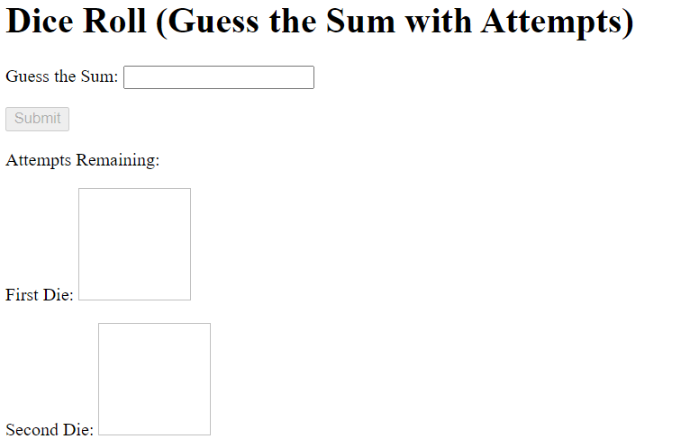

 
 

 
 

# Javascript Functions and Events

## Objective: to practice Javascript functions and handle different types of events.

## We want to create an online dice game, the user has to guess the exact number of two dice sum 

## Task:
-  First, you want to take the user info so they can start playing the game, you have to create a form with the user's Name and email and a submit button. when the user submits the form, they should be able to start playing: 

- Second, you have to create a number input field where the user can write their guesses, the guess should be the sum of the two dices.
- the user will have a maximum number of attempts before they lose. Suppose that the number of attempts = 5
- the user should not be able to see the rolling dice until they give their guess and submit it, when the user gives the correct answer or they finish their attempts, then the button they click on to submit the guess should be disabled and they couldn't play again unless they filled the form another time.
- the two dice should be shown as images as follows:  

- Note that the images should start appearing after the first guess. when the user did not give any guesses yet, they should not be able to see any images:

- Note that when the user gives an invalid guess (such as a number that is larger than 12 or less than 2 or a value that is not a number) you should tell them that the value is invalid and that they should a valid value.
