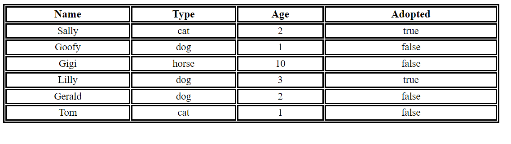
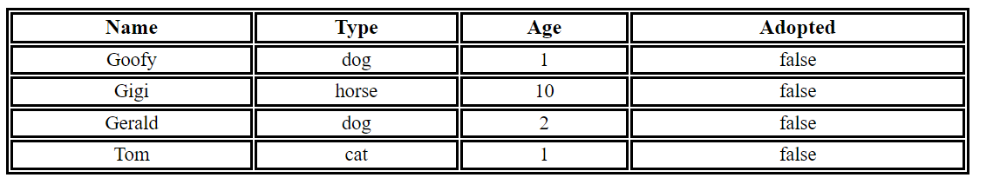

## Open your code for the previous lab then:

1. - Go to your code regarding to the Animal constructor function you've built
   - In this lab we will only need the properties (name, type, age, isAdopted)
   - create multiple objects of the type Animal
   - fit these objects into a table, the table should look like this on the page: 
   
   
   - ask the user if they want to filter the animals depending on their adoption status (using prompt), if their answer was yes, then only show the animals who are not adopted (remove the other rows from the table), for example: 

   

### ***Note: all of the elements and the styling should be done in the JavaScript file, the HTML file should contain only the body element and there should not be a CSS file in this lab***