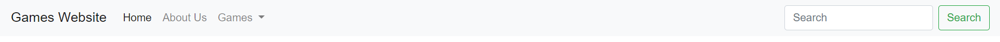
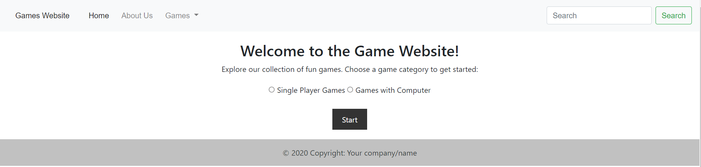
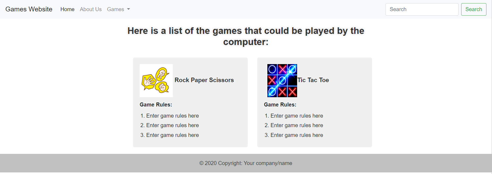

 
 

 

# Intro to Web Development Project

## Build a game-based website:

1.The header of each page should contain the title of your website. There should be a navigation bar to navigate between the pages as well. You can add any other features or elements to your header, it could look like this for example:
 
 

2.	The homepage: it should contain a description for the website and a guide for each game and whether the game needs a single player or the user can play with the computer. Then ask the user which type of games they would like to play, let them choose between the games with the single player and the games that can be played with the computer (you have to filter the games based on this), the homepage could look like this(this is a basic example, try to make the style more engaging and catchy):

3. After selecting any type of games, **games that can be played with the computer for example**, the user should be taken to a page that contains the games that can be played with the computer only, this page could look like this(again, this is a basic example, try to make the style more catchy):

4.	when the user clicks on the game, they should be taken to a page where they can start playing a game, but before starting, they should be shown a form that takes the user's name and make sure that they agree to the rules of the game.

5. Each game should contain a scoring system and a limited attempts to re-play before they lose. The score should be shown to the user whether they won or lost.

5.	The navigation bar should contain links for each game in your website so the user can go directly to the game without reading the description that is included in the homepage.
6.	CSS Styling: Apply consistent and visually appealing styles throughout the website using CSS. 
8.	Add proper title and meta-description tags to your website.
9.	Feel free to use any needed libraries and add additional features to enhance your website.
10.	As a stretch goal, you can create a page that contains the history of the user score in each game they played.
11.	The games can be very simple such as: tic tac toe, rock paper scissors, snake game or guess the number. You can build more complicated games as well.
